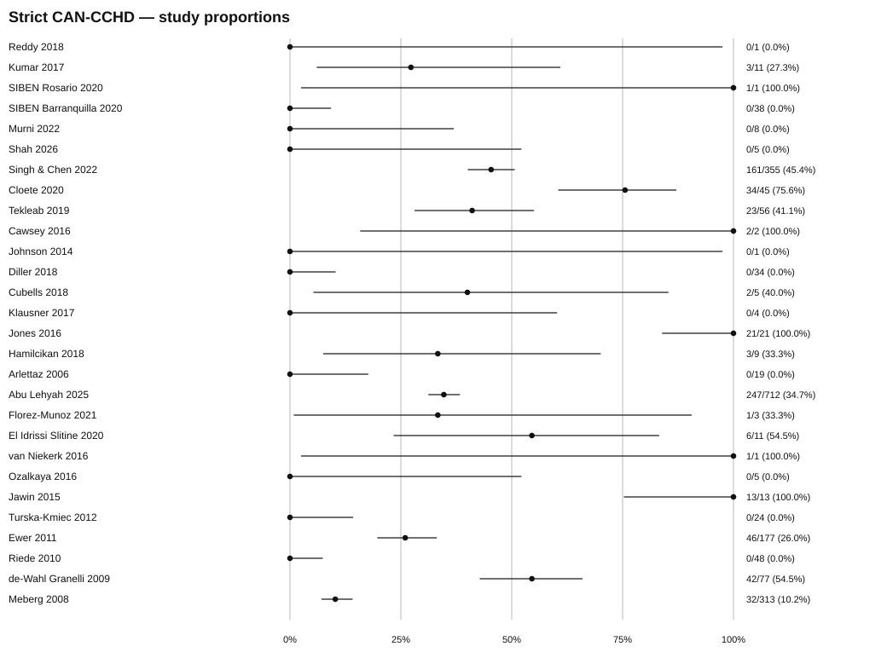
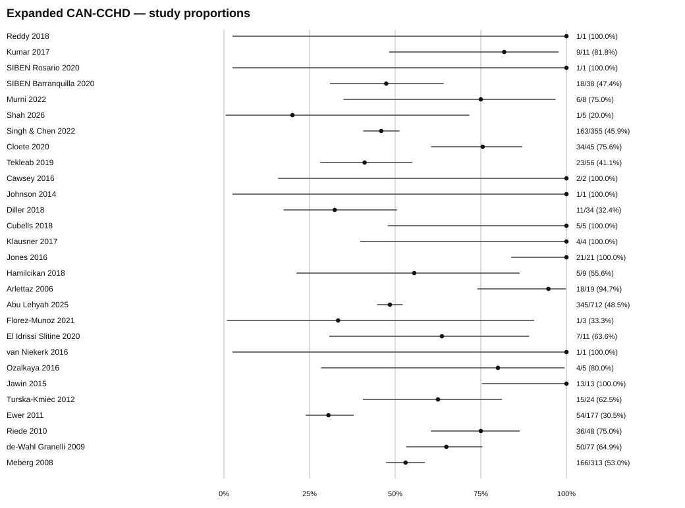

# Beyond Critical Congenital Heart Disease: Clinically Relevant Disease After Failed Newborn Pulse Oximetry Screening - A Systematic Review and Meta-analysis

Rodrigo Liberato de Oliveira, MD2; Mansour Almotairi1; Mohammed Aloqmani1; Abdullah Alrashidi1; Saeed Alghamdi2; Adnan Aselan2; Shaimaa Rakha2,3,4

1 Madinah Cardiac Center, Madinah, Saudi Arabia  
2 Madinah Maternity and Children's Hospital, King Salman Medical City, Madinah, Saudi Arabia  
3 Department of Pediatrics, Faculty of Medicine, Mansoura University, Egypt  
4 Ohud Hospital, Madinah, Saudi Arabia

Corresponding author: Rodrigo Liberato de Oliveira, MD

# Abstract

**Introduction:** Newborn pulse oximetry is designed to detect critical congenital heart disease (CCHD), yet many infants with final failed screens do not have target CCHD and are conventionally classified as false positives. We quantified clinically relevant alternative disease and documented management consequences among these infants.

**Methods:** We systematically reviewed newborn CCHD pulse-oximetry screening studies reporting outcomes after final failed screens. The primary denominator was harmonized-CCHD-negative final failed screens. Strict clinically actionable non-CCHD (CAN-CCHD) required documented treatment, escalation, altered disposition, or clinically required follow-up; Expanded CAN-CCHD additionally included clinically relevant diagnoses without documented qualifying actionability. Random-effects proportions were synthesized using a one-stage exact-binomial logistic-normal model.

**Results:** Twenty-eight independent primary units contributed 1,999 harmonized-CCHD-negative failed screens. Strict CAN-CCHD had a median-study probability of 17.0% (95% confidence interval [CI] 3.1-46.8%) and marginal mean of 33.8%; between-study heterogeneity was extreme (tau=3.369). Expanded CAN-CCHD was substantially more common and less heterogeneous: median-study probability 69.4% (57.7-81.4%), marginal mean 65.8%, tau=1.110. Outcome-specific median-study probabilities were 26.6% for other/non-target structural cardiac diagnoses, 16.7% for infection/sepsis, 10.3% for persistent pulmonary hypertension/pulmonary hypertension, and 8.7% for respiratory disease. Sensitivity analyses did not reverse the interpretation.

**Conclusions:** Among final failed CCHD screens without target CCHD, clinically relevant alternative disease was common, whereas specifically documented management consequences varied markedly across programs. For pediatric cardiologists and neonatal teams involved after a failed screen, the encounter may therefore represent more than exclusion of target heart disease: it is also an opportunity to recognize clinically important alternative neonatal disease and expedite multidisciplinary care.

**Keywords:** critical congenital heart disease; pulse oximetry; newborn screening; neonatal hypoxemia; false-positive screen; pediatric cardiology; meta-analysis

# Introduction

Pulse oximetry screening has become an established component of newborn assessment for critical congenital heart disease (CCHD). Its rationale is straightforward: several life-threatening congenital heart defects can produce clinically silent hypoxemia before ductal closure or overt cardiovascular deterioration, and pulse oximetry can identify a subset of affected newborns who would otherwise leave the birth setting undiagnosed. Early implementation studies, professional statements, and subsequent diagnostic-accuracy meta-analyses established high specificity with moderate sensitivity, supporting widespread adoption of pulse-oximetry screening as an adjunct to prenatal diagnosis and physical examination.1-6 Population-level implementation has also been associated with reductions in early infant cardiac deaths.15

The conventional diagnostic-accuracy framework, however, labels a newborn who fails a CCHD screen but is not ultimately diagnosed with target CCHD as a false positive. That label is mathematically appropriate when the only reference condition is CCHD, but it can be clinically incomplete. Large screening cohorts repeatedly reported pneumonia, sepsis, persistent pulmonary hypertension, respiratory disease, and noncritical structural cardiac abnormalities among such infants.3-5,7-10 A review of implementation studies noted important noncardiac pathology in a substantial fraction of CCHD false-positive screens, but these observations were not designed to quantify a distinct downstream clinical-yield endpoint.18

This distinction has become increasingly relevant. The 2025 American Academy of Pediatrics (AAP) clinical report on CCHD screening explicitly identifies detection of hypoxemic non-CCHD conditions as a secondary benefit, recommends education about the significance of these conditions, and proposes recording the presence and type of non-CCHD condition after failed screens.14 Saudi Arabia has implemented universal CCHD screening at national scale, and Saudi program reports similarly emphasize diagnostic evaluation following a failed screen.10,11 These developments create a practical question that conventional sensitivity and specificity analyses do not answer: among newborns who complete a screening protocol, have a final failed result, and do not have harmonized target CCHD, how often is clinically relevant alternative disease identified, and how often is a qualifying management consequence actually documented?

We therefore conducted a systematic review and random-effects meta-analysis focused specifically on the clinical yield of harmonized-CCHD-negative final failed pulse-oximetry screens. We prespecified a Strict clinically actionable non-CCHD (CAN-CCHD) endpoint requiring a documented treatment, escalation, disposition change, or clinically required follow-up, and an Expanded CAN-CCHD endpoint that additionally captured clinically relevant diagnoses when qualifying actionability was not explicitly documented. We also synthesized major etiologic categories and examined the robustness of the findings to alternative analytic assumptions.

# Methods

## Protocol, reporting framework, and review question

The review was conducted under a version-controlled protocol approved before evidence extraction and quantitative synthesis. The protocol, subsequent prespecified ontology clarifications, final analysis plan, analytic code, and machine-readable results are publicly archived in the project repository. Reporting was structured with reference to the Preferred Reporting Items for Systematic Reviews and Meta-Analyses (PRISMA) 2020 statement.16 The review question was: among newborns who fail pulse-oximetry screening for CCHD but are not diagnosed with CCHD under a harmonized lesion-level target definition, what proportion have a clinically actionable non-CCHD diagnosis?

## Information sources and search strategy

Searches and citation-chasing were completed through 21 August 2026. The evidence search used PubMed/MEDLINE, Europe PMC, Latin American and Caribbean Health Sciences Literature (LILACS) via the Biblioteca Virtual em Saude/Virtual Health Library (BVS), Scientific Electronic Library Online (SciELO), and regional and Eastern Mediterranean public sources including the Index Medicus for the Eastern Mediterranean Region (IMEMR), supplemented by Google Scholar searching and backward/forward citation chasing. Search concepts combined CCHD or critical congenital heart disease with pulse oximetry or oxygen saturation and newborn/neonatal terms. Focused sensitivity searches added false positive, failed screen, hypoxemia/hypoxaemia, persistent pulmonary hypertension of the newborn (PPHN), pulmonary hypertension (PH), sepsis, respiratory disease, and related outcome terms. LILACS/BVS and regional searches used English, Portuguese, and Spanish variants where appropriate. Subscription databases specified in the original source hierarchy (Embase and Scopus/Web of Science) were not available and were not searched.

Search expansion proceeded iteratively rather than stopping after the initial database sweep. Recent-literature, regional, spelling/typographical, grey-literature, seed-author, and citation-chasing searches were reconciled against the evolving report inventory. Searching was closed only after two independent final search waves identified no new routine potentially eligible primary screening cohorts. One PubMed record identifier (22984710) present in a source export could not be linked to a verifiable bibliographic record and was therefore retained as an unresolved search occurrence without a scientific eligibility assignment.

## Eligibility and analytic unit

Eligible reports included newborn or neonatal screening populations evaluating pulse oximetry for CCHD, with final failed/positive screen data that permitted identification of CCHD-negative failed screens and reported at least one diagnosis, clinical outcome, management consequence, or explicit no-diagnosis category in that group. Prospective and retrospective cohorts, hospital or population screening programs, implementation studies, and maternity/newborn screening studies were eligible. Case reports, reviews without original data, studies without an extractable CCHD-negative failed-screen denominator, and overlapping reports without independent participant contribution were excluded from quantitative synthesis.

The analytic unit was the unique newborn after completion of the study's protocol-defined measurement/repeat sequence. An initially abnormal measurement that normalized on a protocol-defined repeat was classified as a pass and was not included in the final failed-screen denominator. Companion publications and potentially overlapping cohorts were linked and adjudicated separately from bibliographic deduplication. Multisite publications could contribute separate site/program units only when participant-level independence was supported.

## Harmonized CCHD target and CAN-CCHD outcomes

The primary denominator was the number of harmonized-CCHD-negative final failed screens. Historical study labels such as critical congenital heart disease, major congenital heart disease, or CCHD were retained for provenance but did not automatically determine the review denominator. Lesions were mapped under a harmonized target ontology. A documented protocol amendment clarified d-transposition of the great arteries and related lesion mapping; all 76 quantitative units were re-adjudicated under the amended rule before the final analytic dataset was locked and before any authoritative pooled estimates were generated.

Strict CAN-CCHD was the prespecified primary endpoint and required a clinically relevant non-CCHD condition with a documented management consequence, including treatment, respiratory or other organ support, escalation of care, neonatal intensive care unit (NICU) or special-care admission, altered or delayed disposition, or a clinically required follow-up pathway. Expanded CAN-CCHD additionally included clinically relevant non-CCHD diagnoses for which the primary report did not document a qualifying management consequence. Diagnosis alone was therefore insufficient for Strict classification.

Secondary etiologic outcomes were persistent pulmonary hypertension of the newborn (PPHN), pulmonary hypertension (PH), respiratory disease, infection/sepsis, and other/non-target structural cardiac diagnoses. These categories were not assumed to be mutually exclusive and were never summed to reconstruct the Expanded endpoint. A category that was not reported or not point-identifiable was treated as missing for that etiologic synthesis, not as zero.

## Data extraction, ascertainment, and quality safeguards

Study-level extraction preserved total screened population, final failed screens, study-defined and harmonized CCHD counts, CAN-CCHD classification, explicit healthy/no-diagnosis status, unknown/unascertained outcomes, etiologic diagnoses, timing, setting, altitude, program-cluster identity, actionability evidence, and source/full-text provenance. Normal echocardiography was not equated with global health, and absence of a reported diagnosis was not recoded as healthy. No individual-level imputation was performed.

Inclusion in the primary meta-analysis required at least 90% ascertainment of outcomes among harmonized-CCHD-negative final failed screens and resolution of participant arithmetic, denominator convention, lesion mapping, and overlap/non-independence. Eligible units that did not satisfy these requirements were retained for sensitivity analysis, withheld pending unresolved data-quality questions, or considered unsuitable for quantitative pooling rather than receiving primary-analysis weight. Because the evidence base consisted predominantly of heterogeneous screening implementation cohorts and the review estimand depended heavily on downstream diagnosis and actionability reporting, no single generic study-level risk-of-bias instrument was imposed post hoc. Instead, prespecified domain-specific quality-control criteria addressed outcome identifiability, ascertainment, missingness, overlap, target mapping, and actionability documentation. The absence of a separate validated risk-of-bias instrument is acknowledged as a limitation.

## Statistical analysis

The authoritative synthesis used a one-stage random-effects binomial-logistic-normal generalized linear mixed model (GLMM) with exact binomial likelihood, logit link, and no continuity correction. The inverse-logit of the model intercept is reported as the median-study probability: the probability corresponding to a study at the median of the random-effects distribution. Because this estimand can differ materially from the population-average probability when between-study heterogeneity is large, we also report the marginal mean obtained by integrating over the fitted random-effects distribution. Between-study heterogeneity is expressed as tau, the standard deviation of the random effect on the logit scale, together with a 95% prediction interval.

Profile-likelihood confidence intervals were used for the GLMM intercept. Numerical integration used 41-point Gauss-Hermite quadrature, with stability checks at 21, 31, 41, and 61 points and multiple optimizer starting values. Prespecified robustness analyses included the Expanded endpoint, a preserved historical pre-amendment framework, aggregation of the related Ibero-American Society of Neonatology (SIBEN) multisite report cluster, leave-one-out refitting, beta-binomial random-effects modeling, and a conventional two-stage logit restricted maximum-likelihood (REML) model with Hartung-Knapp inference. Screening timing (<24 hours, >=24 hours, or mixed/uncertain) was examined using subgroup models and an omnibus GLMM meta-regression diagnostic. Setting and altitude meta-regression were prespecified but judged infeasible because covariate structure was sparse and unbalanced. Analyses were implemented in Python with NumPy, pandas, and SciPy; executable scripts and outputs are archived in the repository.

Conventional funnel asymmetry tests, Egger/Begg tests, and trim-and-fill were not promoted because this was a single-proportion synthesis with boundary observations and strong genuine heterogeneity; under these conditions, funnel geometry is not a reliable diagnostic of publication bias. Reporting bias therefore cannot be statistically excluded and was treated as a limitation rather than adjusted with a funnel-derived pooled estimate.

# Results

## Evidence flow and primary analysis set

The final bibliographic corpus contained 219 resolved reports. Report-level adjudication classified 73 as eligible primary reports, 129 as excluded, 16 as companion or non-independent reports, and one as supporting material only. After cohort-overlap adjudication and multisite expansion, the eligible literature yielded 76 independent quantitative units. Twenty-eight units met all requirements for the primary meta-analysis; 40 were retained for sensitivity analyses only, three were withheld because of unresolved data-quality questions, and five were not suitable for quantitative pooling. None of the latter categories contributed primary-analysis weight.

The 28 independent primary units represented screening programs from Europe, Asia, Africa, North and South America, and Oceania. Most were well-baby or maternity screening programs, with limited out-of-hospital/home-birth representation; timing ranged from the first hours of life to post-24-hour or predischarge protocols. Together they contributed 1,999 harmonized-CCHD-negative final failed screens. Descriptively, 638 met Strict CAN-CCHD and 1,015 met Expanded CAN-CCHD; these crude aggregate ratios are not the random-effects pooled estimates.

## Primary and expanded CAN-CCHD outcomes

For Strict CAN-CCHD, the one-stage GLMM yielded a median-study probability of 17.0% (95% profile-likelihood confidence interval [CI] 3.1%-46.8%). The marginal mean probability was 33.8%. Between-study heterogeneity was extreme (tau=3.369), and the 95% prediction interval spanned approximately 0.03%-99.34%. Accordingly, 17.0% should not be interpreted as a universal patient-level prevalence; rather, it is the fitted probability for a study at the median of a very broad random-effects distribution.

Expanded CAN-CCHD was markedly more common and less heterogeneous. The median-study probability was 69.4% (95% CI 57.7%-81.4%), the marginal mean was 65.8%, tau was 1.110, and the 95% prediction interval was 20.4%-95.2%. The narrower separation between the median-study and marginal mean estimates and the less extreme prediction interval indicate a substantially more stable cross-program signal for the presence of clinically relevant alternative disease than for explicitly documented qualifying management consequences.

## Etiologic outcomes

Outcome-specific exact-reporting syntheses demonstrated clinically recognizable alternative causes of failed screening. The median-study probability of other/non-target structural cardiac diagnoses was 26.6% (95% CI 14.4%-43.0%; k=26), with marginal mean 33.0% and tau=1.556. Infection/sepsis was 16.7% (9.4%-24.2%; k=22), marginal mean 18.9%, tau=0.720. PPHN/PH was 10.3% (4.7%-16.3%; k=22), marginal mean 12.5%, tau=0.790. Respiratory disease was 8.7% (1.6%-23.0%; k=22), but with a substantially higher marginal mean of 20.3% and tau=2.220, reflecting strong heterogeneity and high-yield programs. Because etiologic categories could overlap and reporting subsets differed, these percentages are not additive.

## Robustness and subgroup analyses

Core sensitivity analyses did not reverse the interpretation. Aggregating the related SIBEN multisite report cluster produced median-study probabilities of 17.2% for Strict and 69.0% for Expanded CAN-CCHD. In the preserved historical pre-amendment framework, estimates were 18.4% and 69.7%, respectively. Leave-one-out Strict estimates ranged from 14.8% to 21.1%, and Expanded estimates from 65.3% to 70.9%. Beta-binomial marginal means (33.5% Strict and 66.3% Expanded) closely matched the GLMM marginal means. Conventional two-stage logit REML models with Hartung-Knapp inference were supportive but not authoritative.

Timing-group distributions were 13 predominantly <24-hour units, six predominantly >=24-hour units, and nine mixed/uncertain units. The omnibus timing diagnostics did not demonstrate a clear subgroup association (Strict p=0.263; Expanded p=0.493). This is not evidence of equivalence. In particular, the >=24-hour Strict subgroup contained only three events among 97 observations and produced a boundary-heavy, numerically unstable GLMM; no authoritative pooled Strict estimate was promoted for that subgroup.

# Discussion

## Principal findings

This systematic review reframes a familiar diagnostic-accuracy category. A final failed CCHD pulse-oximetry screen that is negative for harmonized target CCHD is often not clinically uninformative. Across 28 independent primary units, the broader presence of clinically relevant alternative disease was common: the Expanded CAN-CCHD median-study probability was 69.4%. By contrast, the probability that the primary report documented a specific qualifying management consequence was lower and extremely heterogeneous, with a Strict median-study probability of 17.0%, a marginal mean of 33.8%, and an exceptionally wide prediction interval. The distinction between these endpoints is central. The Expanded result describes disease recognition; the Strict result describes documented downstream actionability and is therefore strongly influenced by program design and reporting completeness.

The etiologic analyses give clinical content to the broader signal. Other structural cardiac diagnoses outside the harmonized target were common, while infection/sepsis, PPHN/PH, and respiratory disease also contributed substantially in reporting subsets. This pattern is consistent with the physiology of pulse oximetry: the test detects hypoxemia rather than CCHD itself. CCHD is therefore one important cause of a failed screen, but not the only clinically important one.

## Relation to previous evidence and contemporary guidance

Previous systematic reviews appropriately focused on test accuracy for CCHD. Plana and colleagues found high specificity and a low false-positive rate among asymptomatic newborns, with lower false-positive rates when screening occurred after 24 hours.6 Earlier large prospective cohorts nevertheless repeatedly described clinically significant alternative pathology among CCHD false-positive screens. In the Swedish study by de-Wahl Granelli et al., 31 of 69 pulse-oximetry false positives had other pathology.3 In the PulseOx study, 40 of 169 false-positive infants had other illnesses requiring urgent medical intervention, in addition to six significant non-major cardiac defects.4 Arlettaz et al. found PPHN in five of seven infants with persistent low saturation who did not have congenital heart disease, and high-altitude and out-of-hospital programs have similarly identified PPHN, infection, and respiratory disease.8,9,17

The present review differs from those observations in two ways. First, it treats downstream clinical yield as the primary scientific question rather than an incidental description of false positives. Second, it separates documented actionability from the mere presence of clinically relevant disease. This distinction helps explain why an informal statement that many false positives have important disease can coexist with extreme heterogeneity in Strict CAN-CCHD: many screening publications were designed to establish CCHD accuracy, not to document every treatment, transfer, delayed discharge, or follow-up consequence in the CCHD-negative group.

The findings also align closely with contemporary AAP guidance. The 2025 AAP clinical report explicitly identifies non-CCHD hypoxemic conditions as a secondary benefit of screening, recommends educating stakeholders about disease other than CCHD, and proposes collecting the presence and type of non-CCHD conditions following failed screens.14 Our analysis provides a quantitative synthesis for that policy direction and suggests that downstream non-CCHD yield is not a marginal phenomenon.

## Clinical implications for pediatric cardiology and neonatal care

A failed CCHD screen typically triggers clinical escalation: repeat assessment, evaluation of hypoxemia, and often echocardiography or pediatric-cardiology involvement depending on local pathways.2,10-14 The role of the pediatric cardiologist in this pathway varies across health systems and should not be overstated. Nevertheless, when cardiology is involved early, the clinical task is broader than simply declaring the absence of target CCHD. A structurally reassuring echocardiogram does not resolve the reason for hypoxemia. Recognition of PPHN, infection, respiratory disease, or non-target structural heart disease may require immediate communication, referral, treatment, altered disposition, or coordinated follow-up.

This point is particularly relevant in Saudi Arabia, where universal CCHD screening has been implemented nationally and post-failure assessment is embedded within neonatal and cardiac-care pathways.10,11 For pediatric cardiologists, the screening encounter can therefore be viewed as a diagnostic junction: exclusion of target CCHD is one objective, but recognition and expedited routing of alternative neonatal disease may contribute materially to the final care delivered. The current data do not show that cardiology involvement itself improves outcomes, and they do not assign ownership of noncardiac disease to cardiologists; they identify a population in which clinically relevant alternative disease is common.

## Implications for screening metrics and program evaluation

The term false positive should retain its standard statistical meaning when reporting CCHD screening specificity. The present findings do not argue for redefining diagnostic-accuracy metrics. They do suggest, however, that program evaluation should distinguish test-error burden from downstream clinical yield. A failed screen that does not detect target CCHD can simultaneously be a false positive for the target condition and a clinically useful signal of another hypoxemic disorder. Program dashboards and future studies could therefore report both the CCHD false-positive rate and structured downstream outcomes among CCHD-negative failed screens.

The extreme heterogeneity in Strict CAN-CCHD also provides a methodological lesson. It likely reflects a combination of real differences in populations, timing, referral thresholds, altitude, and program structure, as well as major differences in what investigators chose to document after CCHD was excluded. Standardized minimum datasets that capture alternative diagnosis, management, disposition, and follow-up after failed screening would permit more transportable estimates and more meaningful comparison among programs. The AAP recommendation to collect non-CCHD conditions is an important step in this direction.14

## Strengths and limitations

This review has several strengths. The evidence database was reconstructed independently from verified source records, with report identity, companion relationships, cohort overlap, and multisite structure adjudicated before quantitative weighting. The primary denominator was harmonized at lesion level rather than accepting each publication's historical target label. Actionability required explicit source evidence and was not inferred from diagnosis alone. Missing or non-point-identifiable outcomes were preserved rather than recoded as zero or healthy. The primary model used exact binomial likelihood without continuity correction, and extensive sensitivity analyses, quadrature validation, and leave-one-out analyses did not reverse the interpretation. The complete primary input, extraction audit trail, code, and machine-readable results are publicly available.

The review also has important limitations. First, Strict CAN-CCHD is documentation-sensitive. Many source studies were designed to assess CCHD screening accuracy and did not systematically record downstream treatment or disposition for CCHD-negative infants; Strict actionability is therefore likely to be under-ascertained in some programs. Expanded CAN-CCHD addresses diagnostic underdocumentation but must not be interpreted as proven actionability. Second, between-study heterogeneity, especially for Strict and respiratory outcomes, was very high; pooled values are summaries of a broad distribution rather than universal patient-level frequencies. Third, etiologic categories were variably reported and could overlap, requiring outcome-specific denominators. Fourth, no separate validated study-level risk-of-bias instrument or formal certainty-of-evidence framework was applied; quality control instead relied on prespecified criteria for outcome identifiability, ascertainment, missingness, overlap, and actionability. Fifth, Embase and Scopus/Web of Science were not available, although the search incorporated multiple public bibliographic and regional sources, supplementary Google Scholar, citation chasing, recent and grey-literature searches, and two final search waves yielding no new eligible primary cohorts. Sixth, conventional funnel-based small-study bias inference was not considered valid for this boundary-heavy, highly heterogeneous single-proportion synthesis, so reporting bias cannot be excluded. Finally, the reconstructed review corpus contained 219 resolved reports but did not retain a fully auditable exact pre-deduplication source-occurrence denominator suitable for a conventional identification-stage PRISMA count; we therefore do not infer one.

# Conclusions

Among newborns with final failed pulse-oximetry screens who did not have harmonized target CCHD, clinically relevant alternative disease was common. The broader Expanded CAN-CCHD signal was relatively consistent across programs, whereas specifically documented actionability varied markedly. CCHD false-positive screens should therefore not automatically be equated with clinically uninformative encounters. For neonatal teams and pediatric cardiologists involved in post-failure evaluation, exclusion of target CCHD may be only one part of the diagnostic task. Standardized reporting of alternative diagnoses and management consequences after failed screens would improve future program evaluation and clarify the full clinical value of newborn pulse-oximetry screening.

## Table 1. Random-effects proportional synthesis

| **Outcome** | **k** | **Events / denominator\*** | **Median-study probability, % (95% CI)** | **Marginal mean, %** | **tau** | **95% prediction interval, %** |
|---|---:|---:|---:|---:|---:|---:|
| Strict CAN-CCHD | 28 | 638 / 1,999 | 17.0 (3.1-46.8) | 33.8 | 3.369 | 0.03-99.34 |
| Expanded CAN-CCHD | 28 | 1,015 / 1,999 | 69.4 (57.7-81.4) | 65.8 | 1.110 | 20.4-95.2 |
| PPHN / PH | 22 | 148 / 1,071 | 10.3 (4.7-16.3) | 12.5 | 0.790 | 2.4-35.1 |
| Respiratory disease | 22 | 126 / 1,063 | 8.7 (1.6-23.0) | 20.3 | 2.220 | 0.12-88.1 |
| Infection / sepsis | 22 | 212 / 1,063 | 16.7 (9.4-24.2) | 18.9 | 0.720 | 4.7-45.1 |
| Other/non-target structural cardiac diagnosis | 26 | 280 / 1,952 | 26.6 (14.4-43.0) | 33.0 | 1.556 | 1.7-88.4 |

*\* Observed event/denominator totals are descriptive aggregates, not random-effects estimates. Etiologic categories use outcome-specific reporting subsets, may overlap, and must not be summed. k denotes the number of contributing analytic units; CI, confidence interval; PPHN, persistent pulmonary hypertension of the newborn; PH, pulmonary hypertension.*

## Table 2. Core sensitivity and robustness analyses

| **Analysis** | **Endpoint** | **k** | **Estimate** | **Interpretation** |
|---|---|---:|---:|---|
| Historical pre-amendment framework | Strict | 26 | 18.4% (1.9-59.5) | No reversal; historical framework |
| Historical pre-amendment framework | Expanded | 26 | 69.7% (56.0-83.7) | No reversal |
| SIBEN multisite report-cluster aggregation | Strict | 27 | 17.2% (3.8-43.8) | No material change |
| SIBEN multisite report-cluster aggregation | Expanded | 27 | 69.0% (57.2-81.0) | No material change |
| Beta-binomial random-effects | Strict | 28 | 33.5% marginal mean | GLMM marginal mean 33.8% |
| Beta-binomial random-effects | Expanded | 28 | 66.3% marginal mean | GLMM marginal mean 65.8% |
| Conventional logit REML with Hartung-Knapp | Strict | 28 | 29.9% (16.8-47.4) | Supportive two-stage comparison |
| Conventional logit REML with Hartung-Knapp | Expanded | 28 | 60.4% (51.1-69.0) | Supportive two-stage comparison |
| Leave-one-out | Strict | 28 refits | 14.8%-21.1% | No single unit reverses conclusion |
| Leave-one-out | Expanded | 28 refits | 65.3%-70.9% | No single unit reverses conclusion |

*SIBEN, Ibero-American Society of Neonatology; GLMM, generalized linear mixed model; REML, restricted maximum likelihood.*

## Table 3. Evidence-set disposition and analytic inclusion

| **Stage** | **Count** | **Role** |
|---|---:|---|
| Resolved reports in the final review corpus | 219 | Bibliographic review corpus |
| Eligible primary reports | 73 | Primary-study eligibility |
| Companion or non-independent reports | 16 | Linked to primary reports; no independent report weight |
| Supporting report | 1 | Supporting material only |
| Excluded reports | 129 | Excluded after full eligibility adjudication |
| Independent quantitative units | 76 | After overlap resolution and multisite expansion |
| Units included in the primary meta-analysis | 28 | Authoritative primary synthesis |
| Units retained for sensitivity analyses only | 40 | No primary-analysis weight |
| Units withheld for unresolved data-quality questions | 3 | Excluded from primary synthesis |
| Units not suitable for quantitative pooling | 5 | No primary-analysis weight |

*Figure 1. Study-level Strict CAN-CCHD proportions among harmonized-CCHD-negative final failed pulse-oximetry screens. Points show observed unit proportions; the authoritative random-effects synthesis used a one-stage exact-binomial logistic-normal GLMM. The pooled median-study probability was 17.0% (95% CI 3.1%-46.8%), marginal mean 33.8%, tau 3.369, with extreme between-study heterogeneity.*

*Figure 2. Study-level Expanded CAN-CCHD proportions among harmonized-CCHD-negative final failed pulse-oximetry screens. Expanded CAN-CCHD includes Strict CAN-CCHD plus clinically relevant diagnoses for which qualifying actionability was not directly demonstrated. The median-study probability was 69.4% (95% CI 57.7%-81.4%), marginal mean 65.8%, tau 1.110.*

# Declarations

**Ethics approval:** Not applicable. This systematic review synthesized published aggregate data and did not involve direct enrollment of human participants or access to identifiable patient-level data.

Funding: This research received no external funding.

Competing interests: The authors declare no competing interests.

Data and code availability: The final analysis inputs, extraction and audit documents, executable analysis scripts, and machine-readable results are available in the public CAN-CCHD repository: https://github.com/DitoLiberato/CAN-CCHD-Browser-Operator-Agent

# References

1. Mahle WT, Newburger JW, Matherne GP, Smith FC, Hoke TR, Koppel R, et al. Role of pulse oximetry in examining newborns for congenital heart disease: a scientific statement from the American Heart Association and American Academy of Pediatrics. Circulation. 2009;120(5):447-458. doi:10.1161/CIRCULATIONAHA.109.192576.
2. Kemper AR, Mahle WT, Martin GR, Cooley WC, Kumar P, Morrow WR, et al. Strategies for implementing screening for critical congenital heart disease. Pediatrics. 2011;128(5):e1259-e1267. doi:10.1542/peds.2011-1317.
3. de-Wahl Granelli A, Wennergren M, Sandberg K, Mellander M, Bejlum C, Inganas L, et al. Impact of pulse oximetry screening on the detection of duct dependent congenital heart disease: a Swedish prospective screening study in 39,821 newborns. BMJ. 2009;338:a3037. doi:10.1136/bmj.a3037.
4. Ewer AK, Middleton LJ, Furmston AT, Bhoyar A, Daniels JP, Thangaratinam S, et al. Pulse oximetry screening for congenital heart defects in newborn infants (PulseOx): a test accuracy study. Lancet. 2011;378(9793):785-794. doi:10.1016/S0140-6736(11)60753-8.
5. Riede FT, Worner C, Dahnert I, Mockel A, Kostelka M, Schneider P. Effectiveness of neonatal pulse oximetry screening for detection of critical congenital heart disease in daily clinical routine: results from a prospective multicenter study. Eur J Pediatr. 2010;169(8):975-981. doi:10.1007/s00431-010-1160-4.
6. Plana MN, Zamora J, Suresh G, Fernandez-Pineda L, Thangaratinam S, Ewer AK. Pulse oximetry screening for critical congenital heart defects. Cochrane Database Syst Rev. 2018;3:CD011912. doi:10.1002/14651858.CD011912.pub2.
7. Sendelbach DM, Jackson GL, Lai SS, Fixler DE, Stehel EK, Engle WD. Pulse oximetry screening at 4 hours of age to detect critical congenital heart defects. Pediatrics. 2008;122(4):e815-e820. doi:10.1542/peds.2008-0781.
8. Narayen IC, Blom NA, Bourgonje MS, Haak MC, Smit M, Posthumus F, et al. Pulse oximetry screening for critical congenital heart disease after home birth and early discharge. J Pediatr. 2016;170:188-192.e1. doi:10.1016/j.jpeds.2015.12.004.
9. Tekleab AM, Sewnet YC. Role of pulse oximetry in detecting critical congenital heart disease among newborns delivered at a high altitude setting in Ethiopia. Pediatr Health Med Ther. 2019;10:83-88. doi:10.2147/PHMT.S217987.
10. Almawazini AM, Hanafi HK, Madkhali HA, Majrashi NB. Effectiveness of the critical congenital heart disease screening program for early diagnosis of cardiac abnormalities in newborn infants. Saudi Med J. 2017;38(10):1019-1024. doi:10.15537/smj.2017.10.20295.
11. AlAql F, Khaleel H, Peter V. Universal Screening for CCHD in Saudi Arabia: The Road to a State of the Art Program. Int J Neonatal Screen. 2020;6(1):13. doi:10.3390/ijns6010013.
12. Oster ME, Aucott SW, Glidewell J, Hackell J, Kochilas L, Martin GR, et al. Lessons Learned From Newborn Screening for Critical Congenital Heart Defects. Pediatrics. 2016;137(5):e20154573. doi:10.1542/peds.2015-4573.
13. Martin GR, Ewer AK, Gaviglio A, Hom LA, Saarinen A, Sontag M, et al. Updated Strategies for Pulse Oximetry Screening for Critical Congenital Heart Disease. Pediatrics. 2020;146(1):e20191650. doi:10.1542/peds.2019-1650.
14. Oster ME, Pinto NM, Pramanik AK, Markowsky A, Schwartz BN, Kemper AR, et al. Newborn Screening for Critical Congenital Heart Disease: A New Algorithm and Other Updated Recommendations: Clinical Report. Pediatrics. 2025;155(1):e2024069667. doi:10.1542/peds.2024-069667.
15. Abouk R, Grosse SD, Ailes EC, Oster ME. Association of US State Implementation of Newborn Screening Policies for Critical Congenital Heart Disease With Early Infant Cardiac Deaths. JAMA. 2017;318(21):2111-2118. doi:10.1001/jama.2017.17627.
16. Page MJ, McKenzie JE, Bossuyt PM, Boutron I, Hoffmann TC, Mulrow CD, et al. The PRISMA 2020 statement: an updated guideline for reporting systematic reviews. BMJ. 2021;372:n71. doi:10.1136/bmj.n71.
17. Arlettaz R, Bauschatz AS, Monkhoff M, Essers B, Bauersfeld U. The contribution of pulse oximetry to the early detection of congenital heart disease in newborns. Eur J Pediatr. 2006;165(2):94-98. doi:10.1007/s00431-005-0006-y.
18. Narayen IC, Blom NA, Ewer AK, Vento M, Manzoni P, te Pas AB. Aspects of pulse oximetry screening for critical congenital heart defects: when, how and why? Arch Dis Child Fetal Neonatal Ed. 2016;101(2):F162-F167. doi:10.1136/archdischild-2015-309205.
19. Grosse SD, Peterson C, Abouk R, Glidewell J, Oster ME. Cost and Cost-Effectiveness Assessments of Newborn Screening for Critical Congenital Heart Disease Using Pulse Oximetry: A Review. Int J Neonatal Screen. 2017;3(4):34. doi:10.3390/ijns3040034.
